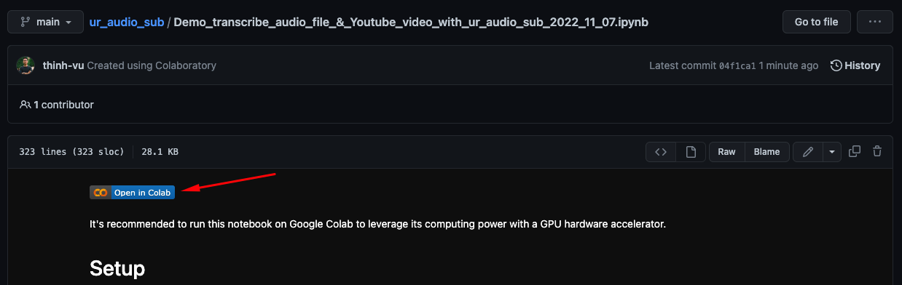

# I. INTRODUCTION
`ur_audio_sub` made generating captions easy for any audio files &amp; youtube video using OpenAI Whisper. Multiple languages support.

# II. REFERENCES
## 2.1. First thing first
You can find the demo Jupiter notebook [here](https://github.com/thinh-vu/ur_audio_sub/blob/main/Demo_transcribe%20audio%20file%20%26%20Youtube%20video%20with%20ur_audio_sub%202022-11-07.ipynb), make a copy and play with this package on Google Colab to generate your first transcription with only 3 steps and 5 lines of code literally.

  
 Demonstration

  

### Install whisper package
You will need to install OpenAI whisper package from source using pip:
Let's runt this command in the terminal fist: `!pip install git+https://github.com/openai/whisper.git -q`

### Install ffmpeg
You also need ffmpeg be installed to start generating captions:
- on Ubuntu or Debian, or Google Colab: `sudo apt update && sudo apt install ffmpeg`
- on MacOS using [Homebrew](https://brew.sh/): `brew install ffmpeg`
- on Windows using [Chocolatey](https://chocolatey.org/): `choco install ffmpeg`
- on Windows using [Scoop](https://scoop.sh/): `scoop install ffmpeg`

### Google Colab is highly recommended
Go to the Google Colab menu: Select `Runtime` > `Change runtime type` and make sure that `GPU` has been chosen. You can run this AI model way faster with GPU on Google Colab than the normal CPU or your personal computer.

## 2.2. How to install this package?
- Using pip to installed pre-builded package on Pypip `pip install ur_audio_sub`
- If you want to use the latest pydata_master version instead of the stable one, you can install it from source with the following command:
`pip install git+https://github.com/thinh-vu/ur_audio_sub.git@main`

_(*) You might need to insert a `!` before your command when running terminal commands on Google Colab._

## 2.3. Where can I find the generated caption?
Please find it in the same folder where you store the audio file. On Google Colab, you can find it in the root folder when generating subtitles for Youtube videos.

## Function references
- Run this command first to import the package to your working environment before using any functions below `from ur_audio_sub import *`

- `ytSub(link='YOUR_YOUTUBE_URL', model='medium', language='', translate=False, lmt=LMT, basepath=ROOT_DIR)` or `ytSub('YOUR_YOUTUBE_URL')` in short
- `subGen_path(file_path, model='medium', language='', translate=False)` or `subGen_path('YOUR_FILE_PATH')` in short

- In case of any issue that happens, you can't generate the Youtube Video caption with `ytSub` function; try the `subGen_path` function with the audio file downloaded path to solving that issue. You can also try this terminal command instead `!whisper 'PATH_TO_YOUR_AUDIO_FILE' --model medium`.

# III. APENDICES
- This package has been built on top of pytube and OpenAI Whisper:
  - [pytube](https://github.com/pytube/pytube) is a genuine, lightweight, dependency-free Python library (and command-line utility) for downloading YouTube videos.
  - [whisper](https://github.com/openai/whisper): Whisper is a general-purpose speech recognition model. It is trained on a large dataset of diverse audio and is also a multi-task model that can perform multilingual speech recognition as well as speech translation and language identification.

# IV. 🙋‍♂️ CONTACT INFORMATION
You can contact me at one of my social network profiles:

  
  <a href="https://www.messenger.com/t/mr.thinh.ueh">
    
  
  </a>
    

---

If you want to support my open-source projects, you can "buy me a coffee" via [Patreon](https://patreon.com/thinhvu?utm_medium=clipboard_copy&utm_source=copyLink&utm_campaign=creatorshare_creator) or Momo e-wallet (VN). Your support will help to maintain my blog hosting fee & to develop high-quality content.

